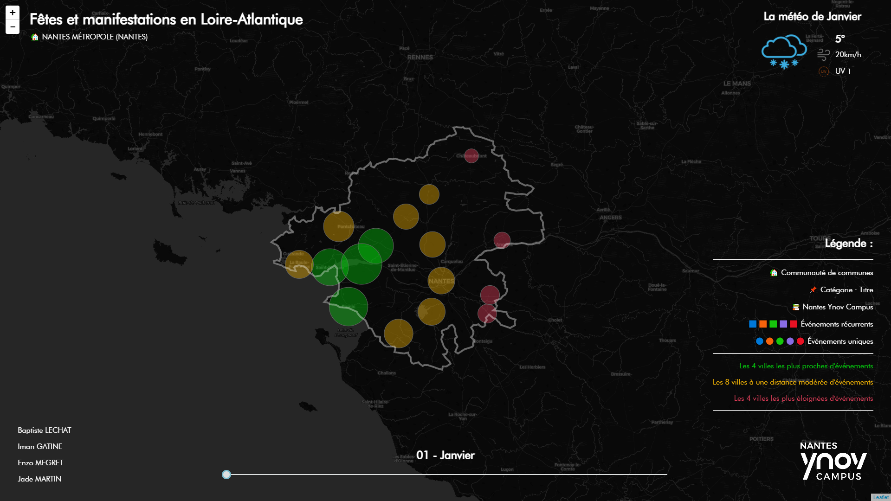
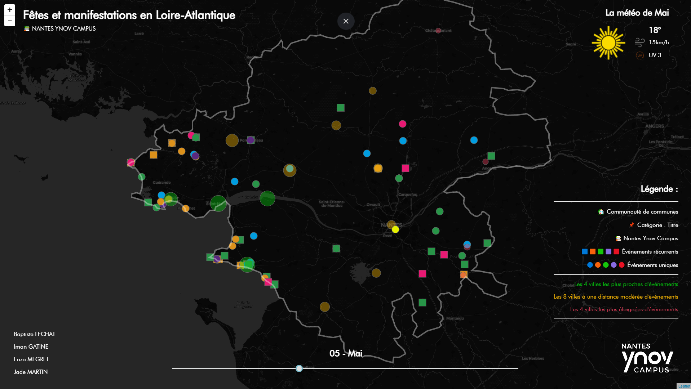

<h1 align="center">Fêtes et manifestations en Loire-Atlantique 📌</h1>


a data visualization and infography project base on open data set about party and show in Loire Atlantique (44 - France).


## 💻 Visit Website
This project use vercel.com (A cloud platform for serverless deployment.)

Go to https://fetes-manifestations-loire-atlantique.vercel.app/ to view the project.

## 📚 TODO
* Add animations.pde into P5js's project
  * unizip animations.zip for view Processing project

## 📸 Project's Screenshots
### Main page

### Zoom


## ✨ Getting Started
These instructions will get you a copy of the project up and running on your local machine for development and testing purposes.

### 🚩 Prerequisites
Nothing special

### ✔ Installing
A step by step series of examples that tell you how to get a development env running.

Step 1: clone the project by using the commands below :
```bash
git clone https://github.com/baptistelechat/fetes-manifestations-loire-atlantique.git
```
Step 2: Run a local server, use Live Server extension of VSCode for example.

## 🏗 Built With


- P5.js → https://p5js.org/
- Mappa.js → https://mappa.js.org/


## 😸 Maintainers
This project is mantained by:
* [Baptiste LECHAT - baptistelechat](https://github.com/baptistelechat)
* Iman GATINE
* Enzo MEGRET
* Jade MARTIN

## 👨‍💻👩‍💻 Contributing

1. Fork it
2. Create your feature branch (git checkout -b my-new-feature)
3. Commit your changes (git commit -m 'Add some feature')
4. Push your branch (git push origin my-new-feature)
5. Create a new Pull Request

## ⭐ Show your support
Give a ⭐️ for support the project or if this project helped you !

## 😂 Gitmoji

This project use Gitmoji : "An emoji guide for your commit messages".

<p align="left">
	<a href="https://gitmoji.carloscuesta.me">
		
	</a>
</p>
<p align="left">
	<a href="https://travis-ci.org/carloscuesta/gitmoji">
		
	</a>
	<a href="https://gitmoji.carloscuesta.me">
		
	</a>
</p>